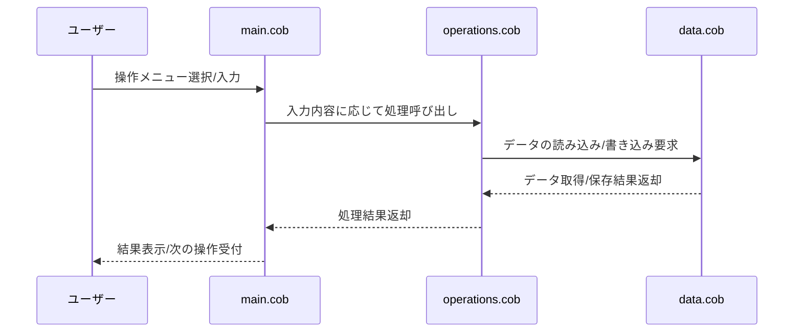

# COBOL Source Code Documentation

このプロジェクトは、学生アカウントに関連する業務ロジックをCOBOLで実装しています。以下に各COBOLファイルの目的、主要な機能、および学生アカウントに関する特定のビジネスルールをまとめます。

## ファイル一覧と目的

### `main.cob`
- **目的:**
  - アプリケーションのエントリーポイント。
  - ユーザーからの入力受付や、全体の処理フロー制御を担当。
- **主な機能:**
  - 学生アカウントの操作メニュー表示。
  - 入力に応じて各種処理（登録、照会、更新、削除など）を呼び出し。

### `operations.cob`
- **目的:**
  - 学生アカウントに対する主要な業務ロジックを実装。
- **主な機能:**
  - 学生アカウントの新規登録、情報照会、更新、削除。
  - 入力値の検証や、ビジネスルールの適用。
- **ビジネスルール例:**
  - 学生IDは一意でなければならない。
  - 必須項目（氏名、学籍番号など）の未入力チェック。
  - アカウント削除時の確認プロンプト。

### `data.cob`
- **目的:**
  - 学生アカウント情報のデータ定義およびデータ管理処理。
- **主な機能:**
  - 学生情報のレコード構造定義。
  - データの読み込み・書き込み処理。
  - ファイルI/Oやデータ永続化の管理。

## 学生アカウントに関する主なビジネスルール
- 学生IDは重複不可。
- 氏名・学籍番号などの必須項目は空欄不可。
- アカウント情報の更新・削除時は、該当レコードの存在確認を必ず行う。
- データの整合性を保つため、操作ごとにバリデーションを実施。

---

このドキュメントは、COBOLコードの保守やモダナイズ作業の参考としてご利用ください。

---

## シーケンス図：アプリのデータフロー

